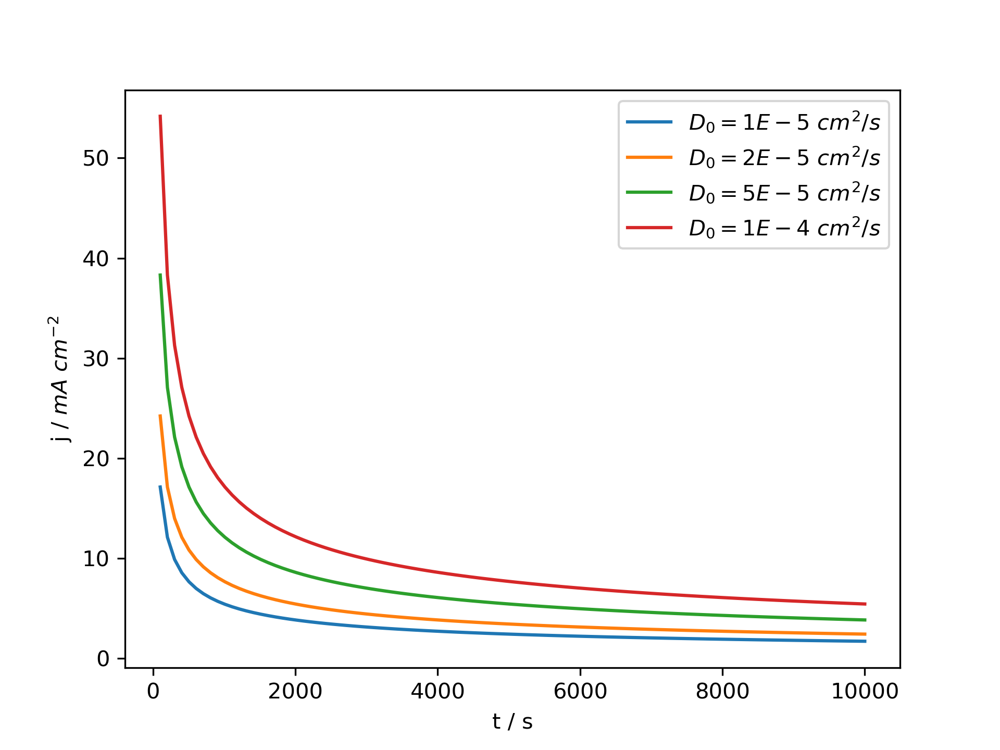
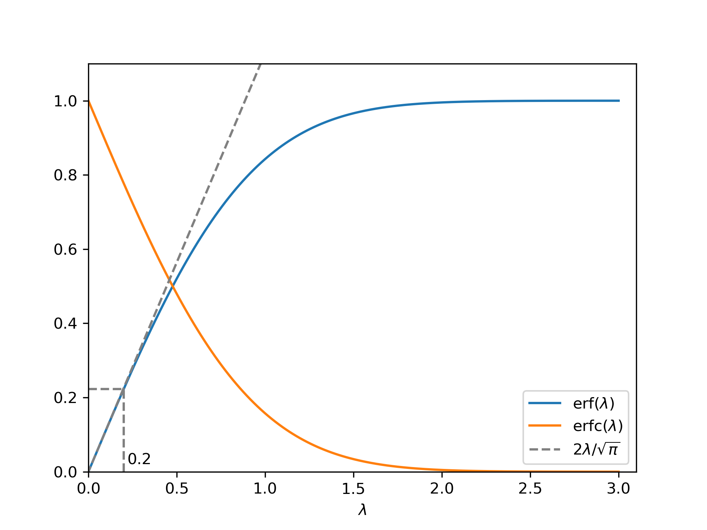
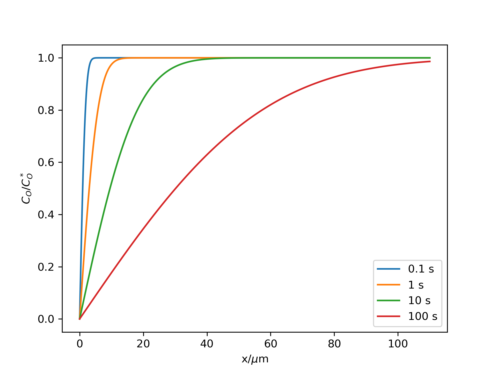
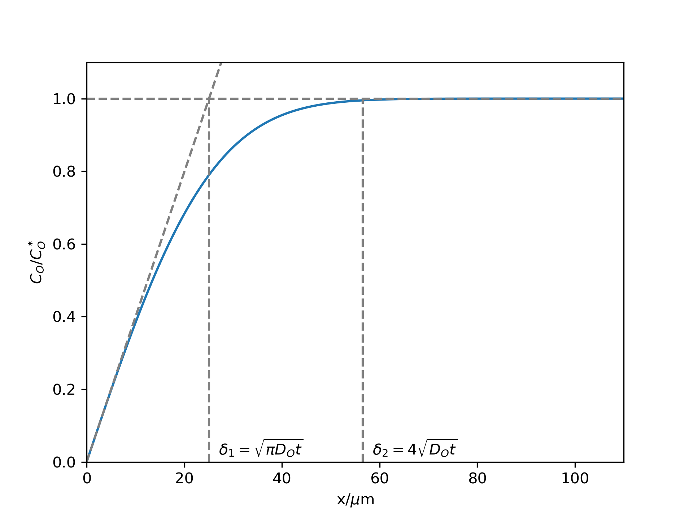

# 暂态电势方法
## 平板电极恒定电势下的暂态扩散
​		对于平板电极，假设扩散层的厚度远小于电极的尺度（通常在大电极面积和短极化时间的条件下），将电极当作无限大的平面，扩散仅沿着垂直于电极表面的方向x进行。根据Fick第二定律：

$$
\frac{\partial C_O(x,t)}{\partial t} = D_O \frac{\partial^2 C_O(x,t)}{\partial x^2}
$$
求解关于坐标和时间$t$的二阶偏微分方程，需要$$t=0$$的初始条件：

$$
C_O(x,0)=C^*_O
$$
 $x=\infty$ 处的半无线扩散边界条件:
$$
\lim_{x\rightarrow\infty}C_O(x,t)=C_O^*
$$
​		对于电化学反应速率足够快的情况，即电极电势足够高，电化学极化可忽略时，即电极表面的氧化物种 O 总是快速反应因此局域浓度为 0，边界条件：
$$
C_O(0,t)=0\ \ (t>0)
$$

### Cottrell方程

​		可通过 Laplace变换求解偏微分方程（1），基础的 Laplace 变换关系如下：
$$
\overline{F}(t)=L\{F(t)\}\equiv \int _0^\infty e^{-st}F(t)
$$

$$
L\bigg\{\frac{\partial C_O(x,t)}{\partial t}\bigg\}=s\overline{C}_O(x,s)-C_O(x,0)\\=s\overline{C}_O(x,s)-C_O^*
$$

$$
L\bigg\{\frac {\partial^2 C_O (x,t)} {\partial x^2}\bigg\}=\frac {\partial^2 \overline{C}_O (x,s)} {\partial x^2}
$$

根据（5-7）对（1）进行 Laplace 变换，得到：
$$
\frac {\partial^2 \overline{C}_O (x,s)} {\partial x^2}-\frac{s}{D_O}\overline{C}_O (x,s)=-\frac{C_O^*}{D_O}
$$
对于常微分方程：
$$
\frac{d^2f(x)}{dx^2}-a^2f(x)=-b
$$
有如下解：
$$
f(x)=\frac{b}{a^2}+A^\prime e^{-ax}+B^\prime e^{ax}
$$
$A^\prime$和$B^\prime$可通过边界条件确定，由（8）和（10）可得：
$$
\overline{C}_O (x,s)=\frac{C_O^*}{s} + A(s)\exp[-(s/D_O)^{1/2}x]+B(s)\exp[(s/D_O)^{1/2}x]
$$
对半无限扩散边界条件（3）进行 Laplace 变换($L[C^*_O]=\frac{C^*_O}{s}$)：
$$
\lim_{x\rightarrow\infty}\overline{C}_O(x,t)=\frac{C^*_O}{s}
$$
由（11）和（12）可知 $B(s)=0$，得到：
$$
\overline{C}_O (x,s)=\frac{C_O^*}{s} + A(s)\exp[-(s/D_O)^{1/2}x]
$$
再由恒定电流极化下，电极表面的边界条件（4）：
$$
\overline{C}_O(0,s)=0
$$
可得$A(s)=-\frac{C_O^*}{s}$，代入（13）：
$$
\overline{C}_O (x,s)=\frac{C_O^*}{s} - \frac{C_O^*}{s}\exp[-(s/D_O)^{1/2}x]
$$
电流与表面O物质流量呈正比，由Fick 第一定律：
$$
\frac{i(t)}{nFA}=-J_O(0,t)=D_O\bigg[\frac{\partial C_O(x,t)}{\partial t}\bigg]_{x=0}
$$
Laplace 变换后：
$$
\frac{\overline{i}(s)}{nFA}=D_O\bigg[\frac{\partial \overline{C}_O(x,s)}{\partial t}\bigg]_{x=0}
$$
代入（15）：
$$
\overline{i}(s)=\frac{nFAD_O^{1/2}C^*_O}{s^{1/2}}
$$
对上式进行逆Laplace 变换（$L^{-1}[s^{-1/2}]=(\pi t)^{-1/2}$）：
$$
i(s)=\frac{nFAD_O^{1/2}C^*_O}{\pi^{1/2}t^{1/2}}
$$
上式为 Cottrell方程，即阴极反应极限扩散电流$i_{d,c}$。



Fig. 1  不同扩散系数下的恒电势极化电流

### 浓度趋势

对（15）逆Laplace 变换
$$
L^{-1}[\frac{\exp(-(k/s)^{1/2}x)}{s}]=erfc[\frac{x}{2(kt)^{1/2}}]
$$

$$
L^{-1}[\frac{C^*_O}s]=C^*_O
$$

得到：
$$
C_O(x,t)=C^*_Oerf\bigg[\frac{x}{2(D_Ot)^{1/2}}\bigg]
$$

#### 高斯误差函数

$$
erf(\lambda)=\frac{2}{\sqrt{\pi}}\int^{\lambda}_0e^{-y^2}dy
$$

#### 互补误差函数

$$
erfc(\lambda) = 1-erf(\lambda) = \frac{2}{\sqrt{\pi}}\int^{\infty}_{\lambda}e^{-y^2}dy
$$

当$\lambda\le 0.2$，$erf(\lambda)$可近似为$\frac{2\lambda}{\sqrt{\pi}}$，

Fig. 2  erf 和 erfc函数图像

​	根据（22）式，可以画出不同时刻的浓度空间分布曲线（$D_O=1\times10^-5\ {\rm cm^2\ s^{-1}}$）：

Fig. 3  不同时刻的氧化态物种浓度空间分布

​	根据浓度曲线，可以定义扩散层厚度，以$x=0$处作切线与$C_O/C_O^*$相交得到的$x=\sqrt{\pi D_Ot}$ 定义为扩散层的有效厚度，当$x=4\sqrt{D_Ot}$，$C_O/C_O^*$超过0.995，可认为$C_O=C_O^*$，因此将这个x定义为扩散层的’总厚度‘。t等于20 s时刻的扩散层厚度如Fig 4所示

Fig. 4 t=20 s时刻的扩散层厚度

## 平板电极恒定电流下的暂态扩散

​	可以用与恒定电势类似的数学方法处理恒定电流下的暂态扩散，即将上述讨论中$C_O(0,t)=0$ 的边界条件变为恒定电流边界条件。Bard的电化学教材中讨论过氧化态物种O的扩散，因此在此我们讨论还原态物种R的扩散。

​	Fick 第二扩散定律：
$$
\frac{\partial C_R(x,t)}{\partial t} = D_R \frac{\partial^2 C_R(x,t)}{\partial x^2}
$$
对等式两边进行 Laplace 变换：
$$
\frac {\partial^2 \overline{C}_R (x,s)} {\partial x^2}-\frac{s}{D_R}\overline{C}_R (x,s)=-\frac{C_R(x,0)}{D_R}
$$
对于上述常微分方程：
$$
\overline{C}_R (x,s)=\frac{C_R(x,0)}{s} + A(s)\exp[-(s/D_R)^{1/2}x]+B(s)\exp[(s/D_R)^{1/2}x]
$$
利用初始条件：
$$
C_R(x,0)=C_R^*
$$
即:
$$
\overline{C}_R(x,0)=\frac{C_R^*}{s}
$$
得到：
$$
\overline{C}_R (x,s)= \frac{C_R^*}{s} + A(s)\exp[-(s/D_R)^{1/2}x]+B(s)\exp[(s/D_R)^{1/2}x]
$$
利用无限扩散条件：
$$
\lim_{x\rightarrow\infty}C_R(x,t)=C_R^*
$$
即：
$$
\lim_{x\rightarrow\infty}\overline{C}_R(x,s)=\frac{C_R^*}{s}
$$
得到：
$$
B(s)=0
$$

$$
\overline{C}_R (x,s)= \frac{C_R^*}{s} + A(s)\exp[-(s/D_R)^{1/2}x]
$$

利用 x=0 处的恒定电流边界条件：
$$
D_R\frac{\partial C_R(x,t)}{\partial x}\Bigg|_{x=0}=-J_R
$$
对等式两侧进行 Laplace 变换：
$$
\frac{\partial \overline{C}_R(x,s)}{\partial x}\Bigg|_{x=0}=-\frac{J_R}{sD_R}
$$
将（34）代入（36）:
$$
-A(s)\sqrt{s/D}\exp[-(s/D_R)^{1/2}x]=-\frac{J_R}{sD_R}
$$
代入 x=0，得到：
$$
A(s)=J_RD_R^{-1/2}s^{-3/2}
$$

$$
\overline{C}_R (x,s)=\frac{C_R^*}{s} + J_RD_R^{-1/2}s^{-3/2}\exp[-(s/D_R)^{1/2}x]
$$

通过逆Laplace 变换：

$$
C_R(x,t)=C_R^* + \frac{J_R}{D_R}\bigg\{2\sqrt\frac{D_Rt}{\pi}\exp(-\frac{x^2}{4D_Rt})-x\cdot erfc\bigg[\frac{x}{2(D_Rt)^{1/2}}\bigg]\bigg\}
$$

代入$J_R=\frac{i}{nFA}$:
$$
C_R(x,t)=C_R^* + \frac{i}{nFAD_R}\bigg\{2\sqrt\frac{D_Rt}{\pi}\exp(-\frac{x^2}{4D_Rt})-x\cdot erfc\bigg[\frac{x}{2(D_Rt)^{1/2}}\bigg]\bigg\}
$$

同理，对于氧化态物种O：
$$
C_O(x,t)=C_O^* - \frac{i}{nFAD_O}\bigg\{2\sqrt\frac{D_Ot}{\pi}\exp(-\frac{x^2}{4D_Ot})-x\cdot erfc\bigg[\frac{x}{2(D_Ot)^{1/2}}\bigg]\bigg\}
$$
